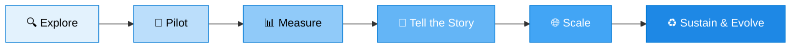

# 🚀 Copilot Transformation Resource Hub

### *Your centralized destination to accelerate Copilot conversations, unlock measurable business value, and scale AI transformation with confidence.*

[**🌐 Visit the Hub**](https://microsoft.github.io/Copilot-Transformation-Resource-Hub/) · [**📊 Analytics Hub**](https://microsoft.github.io/Analytics-Hub/) · [**🛡️ Report a Security Issue**](SECURITY.md)

---

## 🌟 Why This Hub Exists

Organizations adopting Microsoft Copilot consistently ask two questions:

> **"What are others doing?"** — and — **"How do we prove impact?"**

This repository is built to answer both. It brings together curated, field-tested resources from across Microsoft to help teams move from initial exploration to **measurable outcomes** — faster, with more confidence, and with less guesswork.

Whether you are launching your first pilot, building a value story for leadership, or scaling AI transformation across an enterprise, you'll find guidance here for **every stage of the journey**.

---

## 🧭 What You'll Find Here

The hub organizes resources around four pillars that, together, form a complete Copilot transformation toolkit:

<table>
  <tr>
    <td width="50%" valign="top">

### 📊 Analytics
Dashboards, telemetry guides, and adoption signals to **see what's working** — and what's not.
- Usage and engagement metrics
- Adoption health checks
- Power BI templates and reports

</td>
    <td width="50%" valign="top">

### 💼 Business Value
Frameworks and tools to **quantify impact** and build a credible value story.
- ROI and value-realization models
- Outcome libraries by role and function
- Executive-ready narratives

</td>
  </tr>
  <tr>
    <td width="50%" valign="top">

### 🧠 Workforce Transformation
Playbooks for redesigning how work gets done in an AI-augmented organization.
- Skilling and enablement journeys
- Role-based use case catalogs
- Change-management templates

</td>
    <td width="50%" valign="top">

### 🗣️ Employee Voice & Engagement
Listen, learn, and adapt. Resources to **capture sentiment** and act on it.
- Pulse and feedback frameworks
- Champion network playbooks
- Communication kits

</td>
  </tr>
</table>

---

## 🎯 Who This Is For

| If you are a... | Start with... |
|---|---|
| 🏢 **Customer Champion or Sponsor** | Business Value frameworks and executive narratives |
| 📈 **Analytics or BI Lead** | Dashboards, telemetry guides, and reporting templates |
| 👥 **Change & Adoption Lead** | Workforce Transformation playbooks and Employee Voice tools |
| 🛠️ **IT / Deployment Owner** | Analytics setup guides and adoption health checks |
| 🎓 **Learning & Enablement** | Skilling journeys and role-based use case catalogs |

---

## 🗺️ The Transformation Journey

Resources in this hub map to each stage — so wherever you are, there's a clear next step.

---

## 🚦 Getting Started

> 🚧 **The site is currently under construction.** Bookmark the link below and check back soon as we publish curated content.

1. **Visit the live hub** → [microsoft.github.io/Copilot-Transformation-Resource-Hub](https://microsoft.github.io/Copilot-Transformation-Resource-Hub/)
2. **Browse by pillar** — Analytics, Business Value, Workforce Transformation, or Employee Voice
3. **Pick the asset that matches your stage** — Explore, Pilot, Measure, Tell the Story, Scale, or Sustain
4. **Share what works** — see [Contributing](#-contributing) below

---

## 🤝 Contributing

We welcome contributions from the field — proven artifacts, customer-tested templates, and lessons learned all make this hub stronger. To propose a resource:

1. Open an [issue](https://github.com/microsoft/Copilot-Transformation-Resource-Hub/issues) describing the resource and the problem it solves
2. Submit a pull request with a clear description and any supporting context
3. A maintainer will review for quality, accuracy, and fit

This project follows the [Microsoft Open Source Code of Conduct](https://opensource.microsoft.com/codeofconduct/).

---

## 🛡️ Security

Found a security issue? **Please do not open a public issue.** Follow the responsible disclosure process described in [SECURITY.md](SECURITY.md).

---

## 📄 License & Trademarks

This project is released under the terms in [LICENSE.md](LICENSE.md).

This project may contain trademarks or logos for projects, products, or services. Authorized use of Microsoft trademarks or logos is subject to and must follow [Microsoft's Trademark & Brand Guidelines](https://www.microsoft.com/legal/intellectualproperty/trademarks/usage/general). Use of Microsoft trademarks or logos in modified versions of this project must not cause confusion or imply Microsoft sponsorship. Any use of third-party trademarks or logos is subject to those third parties' policies.

---

### 💙 Built with care by Microsoft for the Copilot community.

*Driving adoption. Proving impact. Transforming work — together.*

